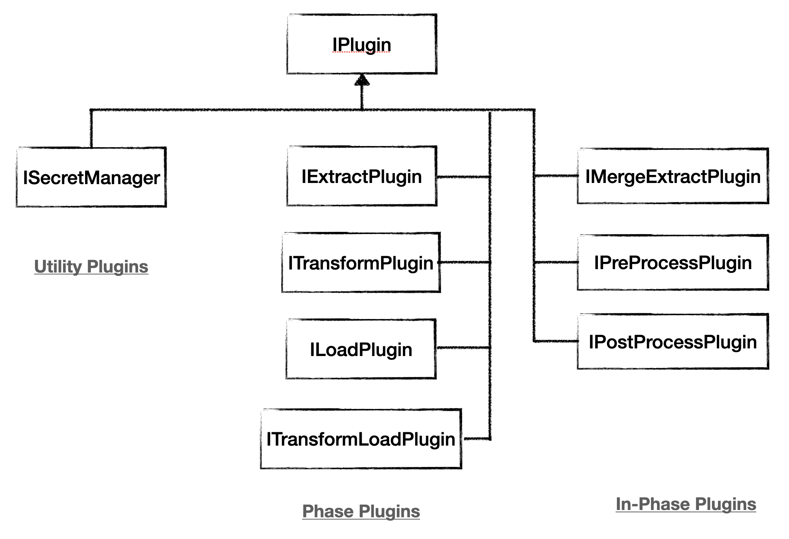

.. _plugins:

Plugins
=======
Plugins extend the functionality of ``pipeline-flow``, allowing users to integrate with 
different data sources, apply custom transformations, and enhance pipeline capabilities without 
modifying the core system.

If you haven't already, check out the :ref:`Plugin Core Concepts <plugin_core_concepts>` to understand the basics of plugins.

We also recommend reading about :ref:`Plugin-in-Plugin <plugin_in_plugin>` technique to learn how to extend the functionality of of existing plugins.

.. _plugin_yaml_structure:

Plugin YAML structure
-----------------------
When using a plugin in the YAML configuration file, whether its :ref:`utility plugins <core_utility_plugins>`  
like :ref:`secrets managers plugins <core_secret_plugins>`, or even :ref:`phase plugins <core_plugins>`, the structure is the same.

Every plugin is defined by a unique name (optional) and a set of arguments that are passed to the plugin. Simple as that!

Here is an example of how to define a plugin in the YAML file:

.. code:: yaml

    plugin_id: some unique id here
    plugin: YOUR_SECRET_PLUGIN_HERE
    args:
      param1: value1
      param2: value2

Plugin categories
-------------------
There are three types of categories in ``pipeline-flow``:

#. **Built-in Plugins**  

   - Official plugins provided by the ``pipeline-flow`` core library.  
   - Fully supported and maintained by the core development team.  
   - Guaranteed to be compatible with the latest versions of ``pipeline-flow``.  

#. **Community Plugins**  

   - Developed and maintained by the ``pipeline-flow`` community.  
   - Useful for specialized use cases not covered by built-in plugins.  
   - May vary in terms of support and update frequency.  

#. **Custom Plugins**  

   - Developed by users to fit their unique requirements.  
   - Provides flexibility for project-specific logic or third-party integrations.  
   - Easily integrated by following the :ref:`guide <plugin_development>`.  

.. _plugin_hierarchy:

Plugin Hierachy
-------------------
Each plugin belongs to a **plugin category** (Built-in, Community or Custom) and can
be further classified into one of the following **plugin types**:

#. **Phase Plugins** 

   - Define the **core phases** of a pipeline, such as Extract, Transform, and Load.  

#. **In-Phase Plugins**  

   - Operate **within phases** to enhance or modify data during processing.  
   - Examples: iMergeExtractPlugin enables to merge all extracted data from multiple sources into a single data structure.

#. **Utility Plugins**  

   - Provide **general-purpose functionality** across the pipeline but are not tied to any specific phase.  
   - Examples: Secret Managers, Pagination Handlers, etc.

Next Steps
-------------
- Explore :ref:`Core Plugins <core_plugins>` to learn about the built-in plugins available out of the box.
- Discover :ref:`Community Plugins <custom_plugins>` to find plugins contributed by the community.
- Explore the Plugin Development Guide to build your own :ref:`custom plugins <plugin_development>`.
- Contribute to the Community Plugin Repository and help others build better pipelines.

Reference
-------------

.. toctree::
   :maxdepth: 2
   :caption: Reference

   core/core_plugins
   community_plugins
   custom_plugins
   plugin_development
   sync_to_async_plugins.rst
