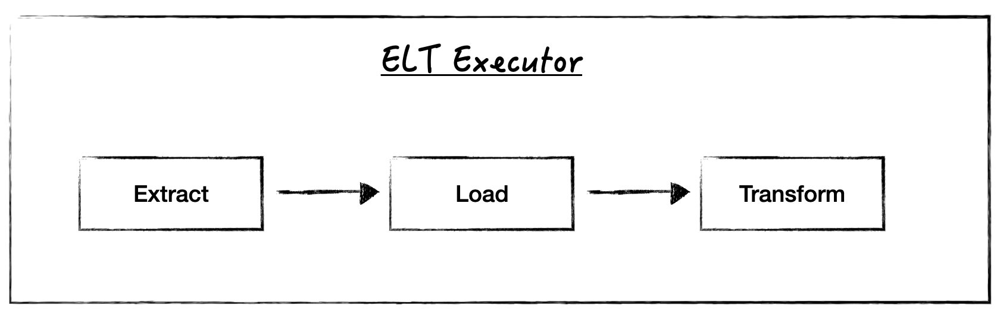

.. _system_overview:

System Overview
================

Pipeline Initialisation Flow
----------------------------
Before pipelines can be executed, the framework first needs to parse the YAML configuration to understand
the pipeline structure. If any community or custom plugins are referenced, the plugin loader handles their
discovery and registration.

Once the YAML is parsed, the pipeline parser converts the parsed YAML into actual pipeline objects. 

These pipeline objects are then passed to the pipeline executor which is responsible for running the pipelines
acocording to their type.

Pipeline Execution Flow
-----------------------
The pipeline orchestrator takes an arbitrary number of pipelines and adds them to an internal queue.
Depending on the configured :ref:`pipeline concurrency <pipeline_concurrency>`, higher number of pipelines
can run concurrently.

Each pipeline is executed according to its pipeline type (e.g. ELT or ETL pipelines).

ETL Pipeline Execution Flow
~~~~~~~~~~~~~~~~~~~~~~~~~~~

ELT Pipeline Execution Flow
~~~~~~~~~~~~~~~~~~~~~~~~~~~

ETLT Pipeline Execution Flow
~~~~~~~~~~~~~~~~~~~~~~~~~~~~~~~~~~

