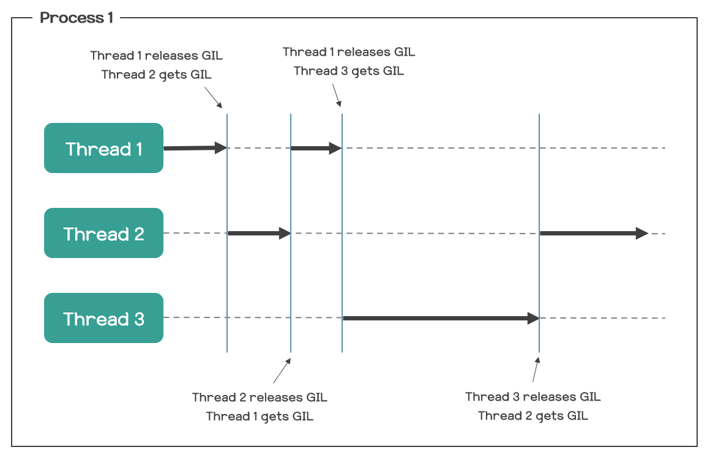

.. _concurrency:

Concurrency Basics
==============================
In a data pipeline, tasks can be broadly classified into two categories: I/O-bound and CPU-bound.

- **I/O-bound tasks**: Tasks that spend most of their time waiting for I/O operations to complete (e.g., reading from a file, making API requests).
- **CPU-bound tasks**: Tasks that spend most of their time performing computations (e.g., data transformation).

I/O-bound tasks are typically slower than CPU-bound tasks because they involve reading or writing data from external sources. 
During this time, the CPU is idle, waiting for the I/O operation to complete. This is often referred to as blocking I/O.

A common approach to improve the performance of I/O-bound tasks is to use threads or asynchronous programming.

Threading in Python
---------------------
The CPython Implementation of Python uses a Global Interpreter Lock (GIL) that allows only one thread to hold the control of the Python interpreter at a time.

This prevents multiple threads from executing Python code concurrently, making it challenging to achieve true parallelism with threads, as shown in the illustration below.

   A simplified illustration of threading and GIL in Python from `Reference <https://velog.io/@yg910524/TIL-46.-GILGlobal-Interpreter-Lock>`_.

Async Programming
-------------------
Asynchronous programming focuses on the contept of coroutines, where each task can be paused and resumed during execution. This 
is managed by an event loop that switches between tasks in a non-blocking way, whenever a task is waiting for I/O operations to complete.

In Python, the `asyncio <https://docs.python.org/3/library/asyncio.html>`_ library provides support for writing concurrent execution of coroutines using the async/await syntax.

**Some benefits include:**

- **Faster Execution**: Multiple I/O operations can be executed concurrently, reducing the overall processing time. 
- **Efficient Resource**: Utilization: Asynchronous execution allows the system to utilize system resources more efficiently.
- **Non-blocking Execution**: Long-running tasks do not block the entire workflow, enabling other tasks to run concurrently.

Threading vs Async
-------------------
Although threads can improve the performance of I/O-bound tasks, it incurs a larger overhead than using coroutines.
This overhead stems from the cost of creating and managing threads, which can be expensive in terms of both memory and CPU usage.
Each thread has its own stack, registers, and other resources that must be managed by the underlying OS. Whenever a CPU
switches between threads, it must save and restore the state of each thread, which can be time-consuming.

In contrast, asychronous programming is more efficient because it uses a single thread to manage multiple tasks.
This approach reduces the overhead associated with creating and managing threads, making it more lightweight and scalable.
It works well with Python for I/O-bound tasks since Python can only execute one thread at a time due to the GIL.

Concurrency in ``pipeline-flow``
--------------------------------
``pipeline-flow`` uses asynchronous programming to execute tasks concurrently, maximizing efficiency and performance.

- **Extract and Load Phases**: These phases are I/O-bound and are executed asynchronously to reduce the overall processing time.
- **Transform and Transform-Load Phases**: These phases are CPU-bound and are executed synchronously to ensure data integrity and consistency.
They are specifically executed in a different thread to not block the existing asyncio event loop, in which other coroutines are running.

    |:warning:| As of now, ``pipeline-flow`` does not support synchronous plugins for Extract and Load phases and will block the entire asyncio event loop
    making the system run sychronously. 
    
    This will be updated in the future to support synchronous plugins for Extract and Load phases
    such that users can run synchronous plugins for I/O-bound operations that do not support async operations natively,
    e.g. using libraries like ``pandas`` or ``pyspark``.

Next Steps
-----------------
- Explore the :ref:`Plugin Basics <plugin_core_concepts>` guide to learn more about plugins.
- Check out the :ref:`Pipeline Orchestration <core_concepts_pipeline_orchestration>` guide to learn how to manage pipeline dependencies and their execution order.